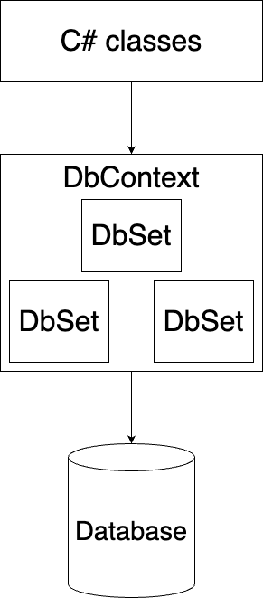

# Introducing Entity Framework Core (EF Core)

Entity Framework Core (EF Core) is an object-relational mapping (ORM) framework for .NET. It allows developers to work with databases using .NET objects, and provides a way to interact with databases in an object-oriented way rather than using raw SQL.

###  Deeper Understanding:

Traditionally, developers interacted with databases through SQL queries. This approach tightly couples your business logic to the database structure and requires manually converting between tables and C# objects.
EF Core eliminates this friction by serving as a **bridge** between the **relational world (tables, rows, columns)** and the **object-oriented world (classes, objects, properties)**.
It does this through **Object-Relational Mapping (ORM)** — which means you define C# classes (entities), and EF Core automatically maps them to corresponding database tables.

EF Core is a **lightweight**, **extensible**, and **cross-platform** version of Entity Framework that works seamlessly with .NET Core and .NET 5/6/7+.
It supports major databases such as **SQL Server, PostgreSQL, MySQL, SQLite, and Oracle**.

---

##  Why use EF Core?

### 1. **Code-First Development**

EF Core allows developers to define their database schema using .NET classes and then automatically generate the corresponding database tables. This approach, known as **Code-First development**, promotes a more agile and flexible approach to database design.

####  Deep Explanation:

In Code-First, your C# classes (called *entities*) represent the data model. EF Core reads these class definitions and generates SQL scripts to create matching tables and relationships in the database.

This is beneficial because:

* You maintain the database structure within your **codebase**, making it version-controlled.
* You can evolve the schema through **migrations** rather than manually editing SQL scripts.
* It allows **domain-driven design**, where the model evolves based on your application's logic rather than the database’s limitations.

**Example:**

```csharp
public class Student
{
    public int Id { get; set; }
    public string Name { get; set; }
}
```

This simple class will generate a `Students` table with columns `Id` and `Name`.

---

### 2. **Object-Relational Mapping (ORM)**

EF Core maps .NET objects to database tables, making it easier to work with databases in an object-oriented manner. This mapping is handled by the Entity Framework Core ORM, which simplifies the process of interacting with databases.

####  Deep Explanation:

ORM eliminates the need to manually write SQL commands like `INSERT`, `UPDATE`, or `DELETE`.
When you modify your objects and call `SaveChanges()`, EF Core automatically generates and executes the corresponding SQL statements.

This mapping is **bi-directional**:

* Data retrieved from the database is **materialized** into objects.
* Changes to objects are **translated** back into SQL when persisted.

**Example:**

```csharp
var student = new Student { Name = "Ali" };
context.Students.Add(student);
context.SaveChanges(); // EF Core automatically executes SQL INSERT
```

---

### 3. **Query Abstraction**

EF Core provides a powerful and flexible query abstraction layer that allows developers to write database queries in a more expressive and readable way. This layer abstracts the underlying SQL syntax, providing a more intuitive and consistent way to interact with databases.

####  Deep Explanation:

EF Core supports **LINQ (Language Integrated Query)** — allowing you to query your data using standard C# syntax.
Behind the scenes, EF Core translates your LINQ expressions into optimized SQL queries, executes them, and converts the result back into entity objects.

**Example:**

```csharp
var activeStudents = context.Students
                            .Where(s => s.Name.Contains("Ali"))
                            .OrderBy(s => s.Id)
                            .ToList();
```

EF Core converts this into SQL:

```sql
SELECT * FROM Students WHERE Name LIKE '%Ali%' ORDER BY Id;
```

> Benefits:
>
> * Strongly typed queries checked at compile-time.
> * Avoids syntax errors and SQL injection risks.
> * Supports filtering, joins, grouping, and projections—all in C#.

---

### 4. **Change Tracking**

EF Core includes built-in change tracking mechanisms that help manage changes to data in memory and synchronize them with the database. This feature simplifies the process of updating and deleting data, reducing the risk of data inconsistencies and ensuring data integrity.

#### Deep Explanation:

When EF Core retrieves data from the database, it **tracks** the entities in memory using an internal mechanism called the **Change Tracker**.
This tracker monitors the **state** of each entity:

* **Added** → new record to insert
* **Modified** → existing record changed
* **Deleted** → record marked for deletion
* **Unchanged** → no changes made

When you call `SaveChanges()`, EF Core checks all tracked entities and automatically generates the necessary SQL commands.

**Example:**

```csharp
var student = context.Students.Find(1);
student.Name = "Updated Name";
context.SaveChanges(); // EF Core executes an UPDATE query
```

This ensures **data consistency** between your in-memory objects and your database.

---

### 5. **Database Migrations**

EF Core supports database migrations, allowing developers to modify database schemas incrementally. This feature simplifies the process of updating databases in a controlled and version-controlled manner, making it easier to manage database changes over time.

#### Deep Explanation:

Migrations are a way to **evolve your database schema** alongside your application code.
Instead of recreating the entire database, EF Core keeps track of the differences and applies only the necessary changes.

**Typical workflow:**

```bash
dotnet ef migrations add InitialCreate
dotnet ef database update
```

This will:

1. Create a `Migrations` folder containing migration files.
2. Generate SQL scripts for changes.
3. Apply them to the database incrementally.

Migrations ensure your database structure stays **in sync** with your models while preserving existing data.

---

## How does EF Core work in code?

### **DbContext**

The `DbContext` is the main class in EF Core that represents a session with the database. It manages the connection to the database, the creation of database queries, and the execution of database commands.

#### Deep Explanation:

`DbContext` acts as a **bridge** between your application and the database. It:

* Keeps track of entities (via change tracking)
* Manages the database connection
* Provides access to the `DbSet` for CRUD operations

**Example:**

```csharp
public class SchoolContext : DbContext
{
    public DbSet<Student> Students { get; set; }

    protected override void OnConfiguring(DbContextOptionsBuilder optionsBuilder)
    {
        optionsBuilder.UseSqlServer("Server=.;Database=SchoolDb;Trusted_Connection=True;");
    }
}
```

When `SaveChanges()` is called, EF Core automatically generates and executes SQL based on tracked entities.

---

### **DbSet**

The `DbSet` is a collection property in the `DbContext` that represents a collection of entities in the database. It provides methods for querying and manipulating the corresponding database table.



#### Deep Explanation:

Each `DbSet<TEntity>` corresponds to a table in your database.
It allows you to perform LINQ queries and CRUD operations on that table.

**Example:**

```csharp
var students = context.Students.ToList();        // SELECT * FROM Students
context.Students.Add(new Student { Name = "Ali" }); // INSERT INTO Students
context.SaveChanges();
```

You can think of `DbSet` as a **repository** that gives you direct access to your entities in the database.

